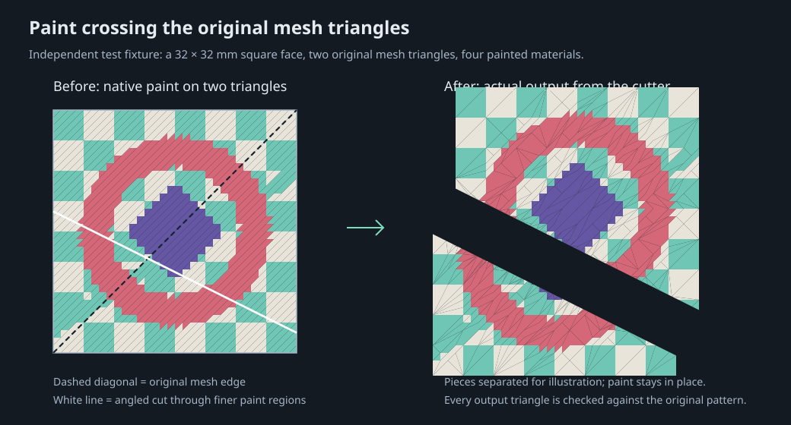

# Test coverage and the two-triangle painted square

## Reproduce

```powershell
npm test
npm run test:coverage
npm run test:model
```

`npm test` runs the complete suite. `test:coverage` reports the core processing modules; the browser UI and Three.js renderer are not included in that percentage. `test:model` regenerates two downloadable examples and the comparison diagram from the same independently defined fixture used in the tests.

The optional native integration tests use `PRUSA_SLICER` or the standard Windows PrusaSlicer installation. They skip with an explicit test result when no executable is available. On this development machine all **81 tests passed, with zero skips**, including both native PrusaSlicer 2.9.6 integration tests. Measured core coverage was **96.05% of lines and 91.52% of branches** on Node.js 24.11.1.

The GitHub `Test application` workflow runs tests and production builds on Windows and Linux with Node.js 22 for pushes and pull requests. Native PrusaSlicer tests are skipped on those runners unless the slicer is separately installed. GitHub Pages publishing also runs the tests before deployment.

The suite was also run in the `node:22-alpine` Linux Docker image: **79 passed, zero failed, and the two native PrusaSlicer tests skipped** because that container has no slicer installation.

## The requested use case

The source is a closed 32 × 32 × 8 mm block. Its top square has exactly **two original mesh triangles**; the entire block has only 12. Those two top triangles store native recursive paint trees containing a four-color checker pattern, a ring, a central diamond, and a narrow stripe. These colors cross the original diagonal and occupy many regions inside each original mesh triangle.

An independent Cartesian grid defines 2,048 reference paint triangles. The compact native paint tree merges uniform regions; importing and making edges conform produces **833 top-surface triangles**, without changing any painted region. This tests both uniform and adaptive paint trees, including mismatched subdivision depths across shared edges.

The cutter resolves the native paint subdivisions into material-assigned mesh triangles first. It then clips those smaller triangles against the cut plane. This handles both the original mesh edges and the interior paint boundaries. Every resulting surface triangle keeps its material; newly exposed interior caps use material 5.



The diagram's left panel is drawn from the independently specified pattern. Its right panel is drawn from the actual output geometry, with the halves moved apart for illustration. The downloadable files retain original model coordinates.

### What the assertions prove

- **Original geometry is genuinely coarse:** the source 3MF contains only 12 mesh triangles, with paint trees on exactly the two top triangles.
- **Paint remains in its original position:** every output top triangle is intersected with the independently defined reference paint polygons. Any positive-area overlap with a different material fails the test. Checking only total painted area would miss a color swap; a deliberately swapped pair of equal-area triangles confirms the spatial checker catches it.
- **No paint is lost or duplicated:** per-material area on each individual half is compared to the independently clipped reference, not just the combined total. The original square has 313, 359, 268, and 84 mm² of materials 1–4 respectively.
- **Geometry remains valid:** closed edges, consistent winding, nondegenerate triangles, outward-facing caps, half-space membership, unchanged source geometry, and total volume are checked.
- **Difficult placements are covered:** cuts through paint interiors, paint vertices, the original mesh diagonal, near vertices, thin edge pieces, tilted planes, negative normals, and a horizontal cut below the painted face. A further 32 deterministic oblique planes exercise varied placements.
- **Repeated cuts and export work:** three pieces produced by two cuts are exported and reimported, then checked against the original paint pattern using each piece's accumulated cut planes.
- **The real slicer accepts the result:** PrusaSlicer saves the original native-paint fixture, the app imports and cuts it twice, PrusaSlicer reports all three pieces as manifold and saves them, and the independently defined paint is checked again after that final save.

The application-side spatial overlap tolerance is normally 0.0000001 mm² per output triangle. The native round-trip check allows 0.0001 mm² because PrusaSlicer stores vertex positions at float32 precision. Tests verify the represented native paint boundaries; they do not claim to reconstruct an ideal curve beyond the subdivisions actually saved by the slicer.

## Try the models

- [Original complex painted square](../public/examples/complex-painted-square.3mf)
- [The same square after a diagonal cut](../public/examples/complex-painted-square-cut.3mf)

With Docker running, download them from `/examples/complex-painted-square.3mf` and `/examples/complex-painted-square-cut.3mf`. Open either in the app or PrusaSlicer. The original uses four surface materials; the cut file uses the fifth material for its new interior faces.

To reproduce the example cut in the app, set Tilt to **90°**, Azimuth to **63.435°**, Position from center to approximately **−4.785 mm**, and cut-face material to **5**. The exact test plane is `x + 2y = 37.3` in millimeters. Preview separation makes the cut surfaces visible without altering the export.

## Suite map

| Suite                         | Coverage                                                                                                 |
| ----------------------------- | -------------------------------------------------------------------------------------------------------- |
| `complex-paint.test.js`       | Two original triangles, complex native paint, exact spatial checks, cuts and export                      |
| `complex-prusa.test.js`       | Complex paint through real PrusaSlicer saves before and after two cuts                                   |
| `paint-codec.test.js`         | Every split-side arrangement, exact child positions, mixed nested splits, unpainted fallback             |
| `geometry-regression.test.js` | Deterministic plane sweep, scale/translation, nested holes/islands, invalid cut parameters               |
| `import-validation.test.js`   | Missing/malformed fields, material defaults, instances, component cycles, palette sources                |
| `worker.test.js`              | Actual worker protocol, selected-piece export, failed operations, 12-step undo, cancellation restoration |
| `core.test.js`                | Extended material slots in both dialects, conformity, hollows, transforms, core 3MF round trips          |
| `prusa.test.js`               | Native PrusaSlicer round trip with extended material indices                                             |

The tests do not cover every possible damaged or self-intersecting mesh, virtual-material recipe, printer profile, or future slicer format. They also do not automate browser visual rendering; those are separate from the geometry and paint guarantees tested here.
